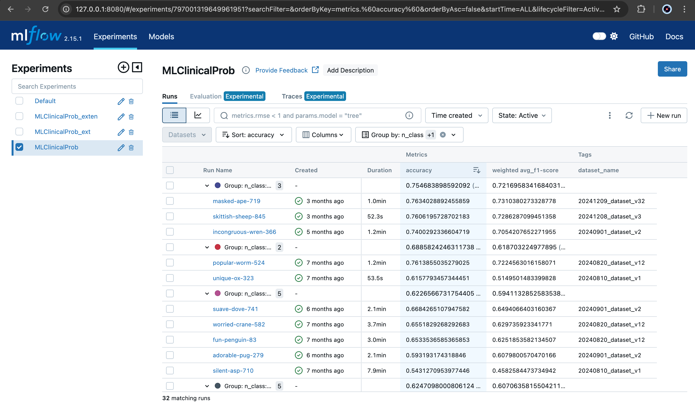
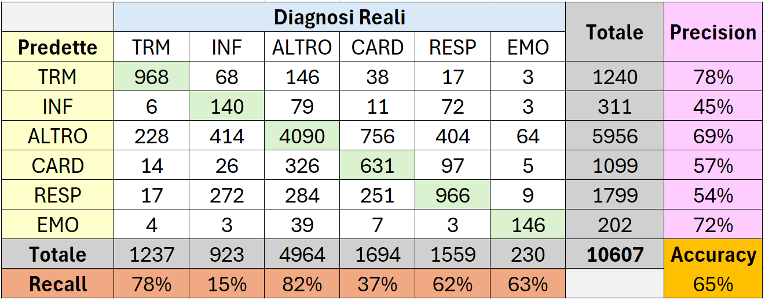

# **Predictive Model for ABG**  

## **Overview**  
This project aims to develop a **classification model** that takes as input parameters extracted from **arterial blood gas (ABG) analysis** and a limited set of patient data collected at the emergency room check-in. The model predicts the most probable pathology category associated with the patient, leveraging insights from historical data.  

## **Scope and Purpose**  
The model is designed to perform inference at a **critical moment** in the diagnostic process—just minutes after a patient enters the emergency room.  

Given the **limited information available** at this early stage, the model is **not expected to provide an exact diagnosis** but rather a **macro-diagnosis**. This means it classifies cases into broad pathology groups, based on the chapter divisions of the **ICD-9 standard**.  

## **Dataset and Preprocessing**  
After a thorough **data cleaning process**, the final dataset includes **53,035** arterial blood gas analyses.  

## **Model Versioning and Deployment**  
- **Model versioning** is managed through **MLflow**, allowing tracking and comparison of different training iterations.  
  
  
  
- **Web Application:** Two model versions have been deployed in a **web app**, accessible at the following link:  
  https://wa-mlclinicalprob-tesi-codazzi.streamlit.app/  (Due to the use of a free version, the app may be "dormant" and may take a few minutes to activate)

## **Performance Evaluation**  
Below is the **confusion matrix** for one of the trained model versions:  

For a more detailed **performance analysis**, refer to:  
- **MLflow logs**  
- The **web app**, which includes a description of the approach used  

## **"Limitations & Future Work"**  
